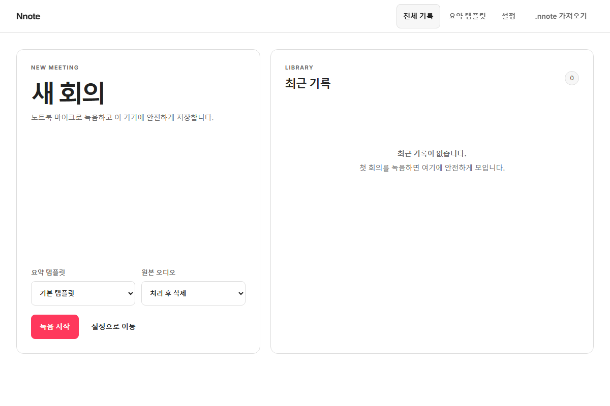
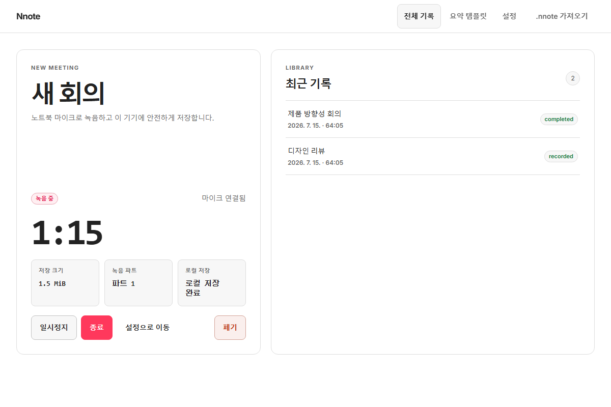
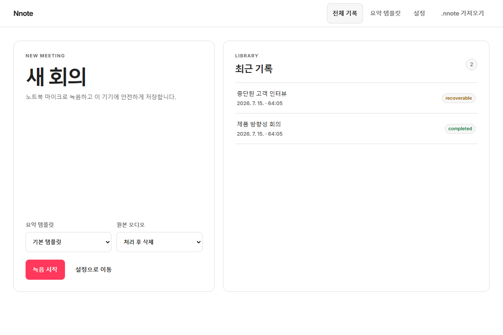
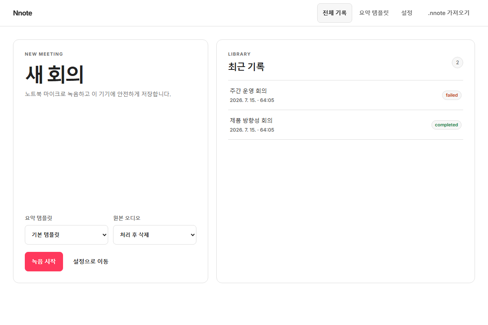
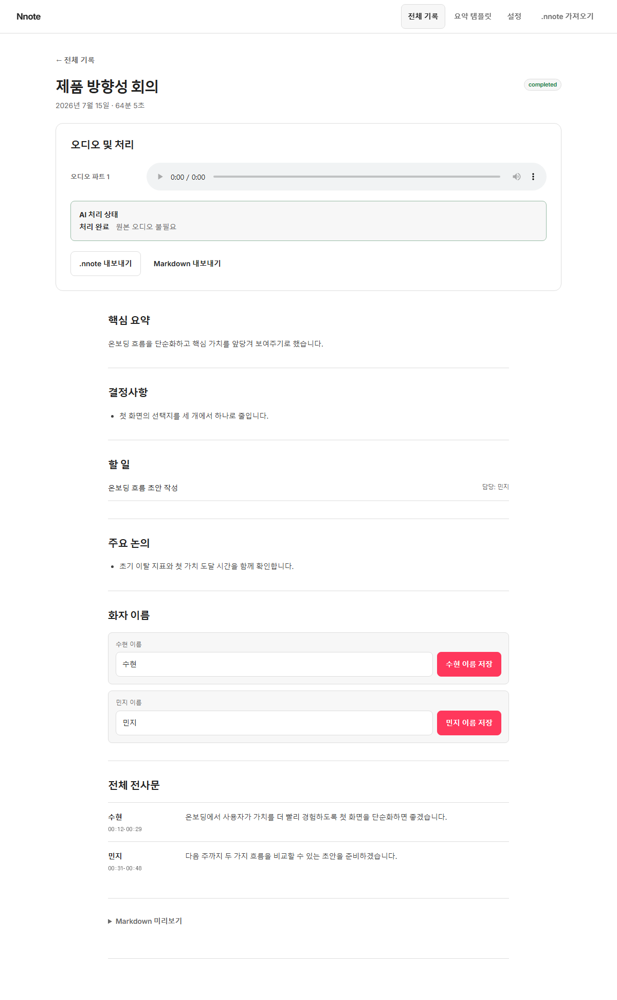
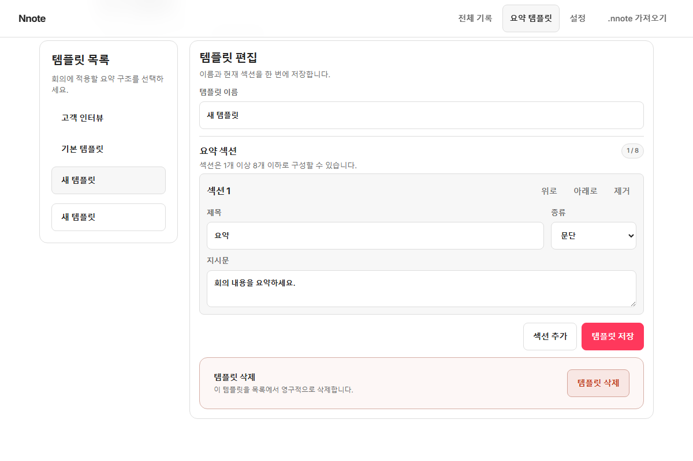
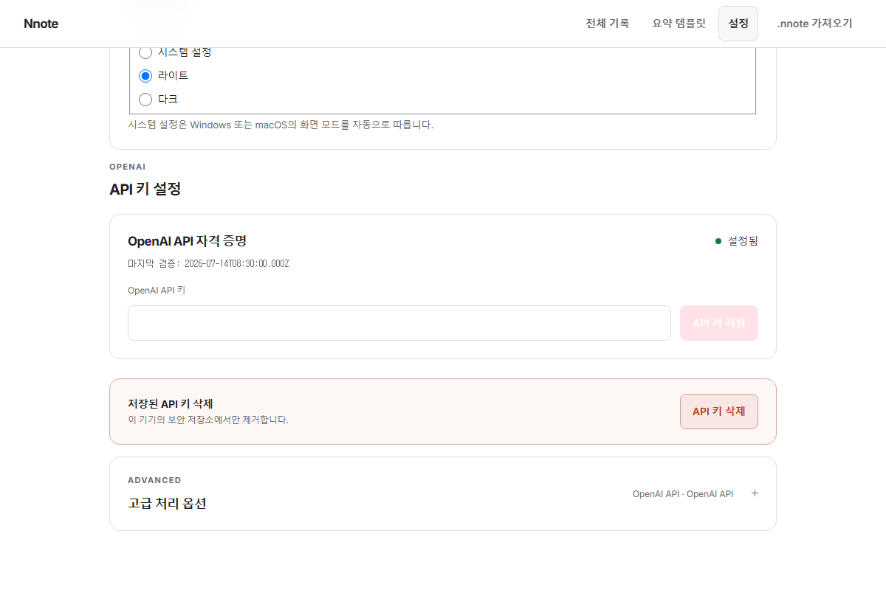

# Nnote design comparison

고정 Windows fixture로 캡처한 기능별 디자인 비교입니다. 기존 Original Before와 `after-linear` 이미지는 SHA-256 checksum으로 고정되어 있으며 이 문서 캡처 과정에서 변경하지 않습니다.

Airbnb 리디자인 이미지는 실제 App의 버튼과 회의 행을 통해 화면을 연 뒤 `after-airbnb`에 저장합니다. 모든 이미지는 1200×800 viewport 캡처이며, 긴 회의 문서인 `05-meeting-detail.png`만 전체 페이지 1200×1942로 캡처합니다.

## 핵심 화면 비교

| 화면 | Original Before | After Linear | After Airbnb |
|---|---|---|---|
| 대시보드와 새 회의 | [](01-dashboard.png) | [](after-linear/01-dashboard.png) | [](after-airbnb/01-dashboard.png) |
| 로컬 녹음 | [](02-recording.png) | [](after-linear/02-recording.png) | [](after-airbnb/02-recording.png) |
| 중단된 녹음 복구 | [](03-recovery.png) | [](after-linear/03-recovery.png) | [](after-airbnb/03-recovery.png) |
| 처리 실패 상태 | [](04-processing-failed.png) | [](after-linear/04-processing-failed.png) | [](after-airbnb/04-processing-failed.png) |
| 완성된 회의 문서 | [](05-meeting-detail.png) | [](after-linear/05-meeting-detail.png) | [](after-airbnb/05-meeting-detail.png) |
| 요약 템플릿 편집 | [](06-template-editor.png) | [](after-linear/06-template-editor.png) | [](after-airbnb/06-template-editor.png) |
| OpenAI API 키 설정 | [](07-api-key-settings.png) | [](after-linear/07-api-key-settings.png) | [](after-airbnb/07-api-key-settings.png) |

실제 API 키 값은 fixture와 이미지에 포함하지 않습니다.

## 처리 공급자와 로컬 모델 상태

이 상태들은 기존 `07-api-key-settings.png` 이후에 추가되어 별도 Original Before 캡처가 없습니다. Linear와 Airbnb 결과를 같은 이름으로 비교할 수 있습니다.

| 상태 | Original Before | After Linear | After Airbnb |
|---|---|---|---|
| 기본 처리 공급자 | 별도 캡처 없음 | [Linear 기본 공급자](after-linear/08-processing-provider-defaults.png) | [Airbnb 기본 공급자](after-airbnb/08-processing-provider-defaults.png) |
| 펼친 고급 처리 옵션 | 별도 캡처 없음 | [Linear 고급 옵션](after-linear/09-processing-provider-advanced.png) | [Airbnb 고급 옵션](after-airbnb/09-processing-provider-advanced.png) |
| Whisper 모델 다운로드 | 별도 캡처 없음 | [Linear 다운로드 상태](after-linear/10-whisper-model-downloading.png) | [Airbnb 다운로드 상태](after-airbnb/10-whisper-model-downloading.png) |
| Whisper 모델 설치됨 | 별도 캡처 없음 | [Linear 설치 상태](after-linear/11-whisper-model-installed.png) | [Airbnb 설치 상태](after-airbnb/11-whisper-model-installed.png) |
| Codex CLI 사용 가능 | 별도 캡처 없음 | [Linear 사용 가능 상태](after-linear/12-codex-cli-available.png) | [Airbnb 사용 가능 상태](after-airbnb/12-codex-cli-available.png) |
| Codex CLI 사용 불가 | 별도 캡처 없음 | [Linear 오류 안내](after-linear/13-codex-cli-unavailable.png) | [Airbnb 문제 해결 안내](after-airbnb/13-codex-cli-unavailable.png) |

모든 fixture는 고정된 모델 크기와 진행률, 안전한 가용성 코드만 사용합니다. API 키, 사용자 로컬 경로, 전사문 및 원시 진단은 이미지에 포함하지 않습니다.

## 테마

| 상태 | Original Before | After Linear | After Airbnb |
|---|---|---|---|
| 라이트 테마 | 별도 캡처 없음 | 별도 캡처 없음 | [Airbnb 라이트 테마](after-airbnb/14-theme-light.png) |
| 다크 테마 | 별도 캡처 없음 | 별도 캡처 없음 | [Airbnb 다크 테마](after-airbnb/15-theme-dark.png) |

두 테마 캡처 모두 실제 설정 화면의 compact, label-aligned radio controls를 보여줍니다.

## 다시 생성하기

```powershell
npx playwright test tests/visual/feature-docs.pw.ts
```
